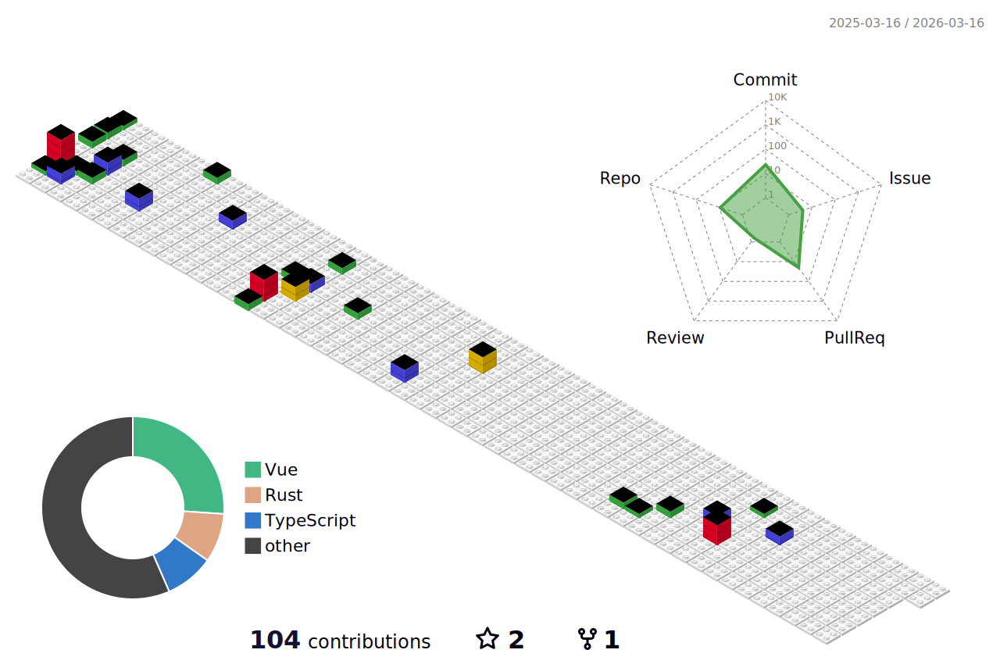

<p>Hi there, I'm Sling. A noob Web Frontend Developer.</p>

```js
console.log('Making bugs.😉');
```

<section>
  <p align="center">
    
  </p>
  <p align="center">
    <picture>
      
    </picture>
  </p>
  <p align="center">
    <picture>
      
    </picture>
  </p>
</section>
